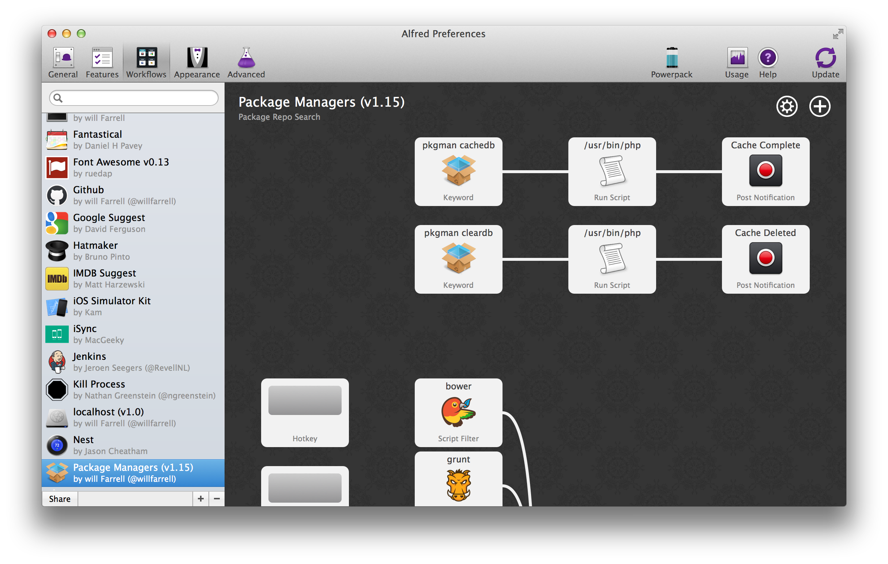

# How to contribute

First off, thanks for you interest in contributing. Everyone who uses this repos really appreciates it.



## Developing & Building the Workflow

There is a `Makefile` to automate setting up & building the workflow.

This `Makefile` have one prerequisite: you must set `$ALFRED_PKGMAN_WORKFLOW_DIR` shell environment variable targeting to workflow path installed in Alfred.

To determine this path on your Mac, you should:

1. Open Alfred Preferences → Workflows
2. Find “Package Managers” in the list
3. Right click on it and select “Open in Finder”

To make a contribution:

1. Clone this repository
2. Set `$AFLRED_PKGMAN_WORKFLOW_DIR` as described above
3. Run `make` to build the workflow and link it to your installed copy
4. Make desired changes to workflow / underlying code base
5. Test that your changes work as desired & no regressions have been introduced
6. Commit your changes & open a Pull Request following the below steps

See below for details on the key elements of the `Makefile`.

### Link your built development copy to Alfred

`make linkSourceFoldersToWorkflow` - links src, bin, vendor folders from your local cloned source code folder of the workflow to corresponding folders that installed in Alfred, located at `$ALFRED_PKGMAN_WORKFLOW_DIR`.

### Build the Alfred workflow

`make dist` - runs `composer install`, copies sources to `./dist`, copies icons and `info.plist` from `$ALFRED_PKGMAN_WORKFLOW_DIR` to `./dist`, zips `./dist` to `./dist/Package Managers.alfredworkflow`

### Prepare a new release

`make release` - builds a new release by running `make dist`, then copying `info.plist` and `Package Managers.alfredworkflow` from `./dist` to the root of the repository.

## Issues

All are welcome.

## Pull Requests

Good pull requests - patches, improvements, new features - are a fantastic help.
They should remain focused in scope and avoid containing unrelated commits. If
your contribution involves a significant amount of work or substantial changes
to any part of the project, please open an issue to discuss it first.

Make sure to adhere to the coding conventions used throughout a project
(indentation, accurate comments, etc.). Please update any documentation that is
relevant to the change you're making.

### Pull Request Process

Please follow this process; it's the best way to get your work included in the
project:

1. [Fork](http://help.github.com/fork-a-repo/) the project, clone your fork,
   and configure the remotes:

   ```bash
   # Clones your fork of the repo into the current directory in terminal
   git clone https://github.com/<your-username>/<this-repo-name>.git
   # Navigate to the newly cloned directory
   cd <folder-name>
   # Assigns the original repo to a remote called "upstream"
   git remote add upstream https://github.com/<this-username>/<this-repo-name>.git
   ```

2. If you cloned a while ago, get the latest changes from upstream:

   ```bash
   git checkout master
   git pull upstream master
   ```

3. Create a new topic branch to contain your feature, change, or fix:

   ```bash
   git checkout -b <topic-branch-name>
   ```

4. Commit your changes in logical chunks. Please adhere to these [git commit
   message guidelines](http://tbaggery.com/2008/04/19/a-note-about-git-commit-messages.html)
   or your pull request is unlikely be merged into the main project. Use git's
   [interactive rebase](https://help.github.com/articles/interactive-rebase)
   feature to tidy up your commits before making them public.

5. Locally merge (or rebase) the upstream development branch into your topic
   branch:

   ```bash
   git pull [--rebase] upstream master
   ```

6. Push your topic branch up to your fork:

   ```bash
   git push origin <topic-branch-name>
   ```

7. [Open a Pull Request](https://help.github.com/articles/using-pull-requests)
   with a clear title and description.
